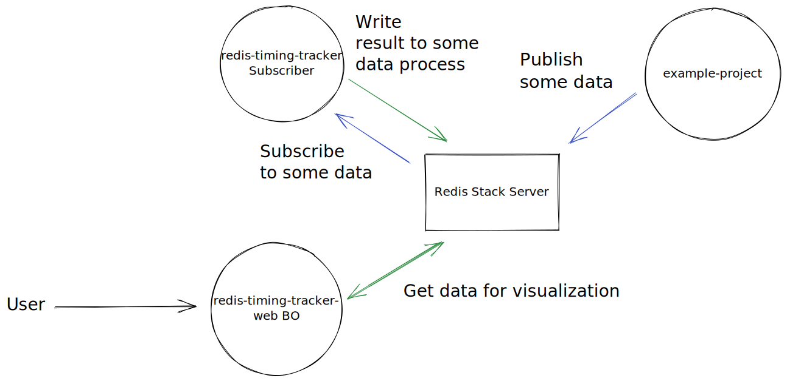

# Redis Timing Tracker

## What is it?

Track the timing of your jest tests to follow the evolution of time passed for each test.

This way you can know when a change in your configuration, a library upgrade or a change in your test, increased drastically the time passed on
your tests.


## How it works

Here is little achitecture diagram:



### Stack used

Type structures are written with Typescript. 

In this project I use 3 services of the Redis Stack:
- Redis pub/sub
- Redis JSON
- Redis Search
- Redis Time Series

### Pub/sub messages

Before looking at how the data is stored. It's important to see how Redis pub/sub is used.
Events are published and subscribed to a topic `timingTopic`. There are 2 types of events:

- Event for each test result that ran with the type `singleTest`. It allows us to know the name of the test, when it has been launched, the duration and the commit sha if we are in a git repository. The full type is the following one:

```ts
type SingleTestTimingEvent = {
    // The type of the event
    type: 'singleTest';
    // The name of the test
    name: string;
    // The potential parent describe names
    describeNames: string[];
    // The duration of the test
    duration: number;
    // The timestamp when the test has been started
    startTimestamp: number;
    // The sha of the commit if we are in a git repository
    commitSha: string | undefined;
    // Indicates if the test finished with error
    hasError: boolean;
}
```

> **Note:** By concatenating the `describeNames` and the `name` we get the `uniqueTestName` of the test.

- Event to summarize all tests run with the type `fullTest`. Thanks to it, we know how much time takes all the tests to run, when the tests ran, the number of test launched and the commit sha if we are in a git repository. The full type is the following one:

 
```ts
type FullTestTimingEvent = {
    // The type of the event
    type: 'fullTest';
    // The duration of running all tests
    duration: number;
    // The timstamp when the user launched tests
    startTimestamp: number;
    // The sha of the commit if we are in a git repository
    commitSha: string | undefined;
    // Indicates if the test finished with error
    hasError: boolean;
}
```


A script is subscribed to the `timingTopic` and persist data in redis.

----

Let's talk about each event separetely to see what is stored and how the data is accessed for each of them.


### `singleTest` event

This is the event to handle the result of a single test run. We want to store multiple things that will be usefull for the page available on `http://localhost:3000/test`.

#### How the data is stored

- The main data we store, is the Time Series. We want to draw some chart to be quickly see the evolution of the duration of tests. So we store the `duration` as value and the `startTimestamp` as key in a time series:

```bash
TS.ADD {uniqueTestName} {startTimestamp} {duration}
```

- For each run, we want to store some additional information like the commit sha. This will be accessible by clicking on a point of the chart. This information is store as `JSON` with the key: `testRunInfo:{uniqueTestName}` 

```bash
JSON.SET testRunInfo:{uniqueTestName} $.{startTimestamp} {value}
```

The format of the value is:

```ts
type TestInfo = {
    // The timstamp when the user launched tests
    startTimestamp: number;
    // The sha of the commit if we are in a git repository
    commitSha: string | null;
    // The duration of running all tests
    duration: number;
}
```


- We want to keep information about the last run for each test that has run:

```bash
JSON.SET runningTests:{uniqueTestName} $ {value}
```

The format of the value is the following one:

```ts
type RunningTest = {
    // The potential parent describe names
    describeNames: string[];
    // The name of the test
    name: string;
    // The unique test name, which the concatenation of describeNames and name
    uniqueTestName: string;
    // The timestamp of the latest run
    latestRunTimestamp: number;
}
```

- Thanks to the previous data, we make an index which will be usefull to search test by `uniqueTestName`:

```bash
FT.CREATE idx:runningTests ON JSON PREFIX runningTests SCHEMA $.uniqueTestName AS uniqueTestName TEXT SORTABLE
```


#### How the data is accessed:


- **Get all test names that has ever ran**:

```bash
FT.SEARCH idx:runningTests "@uniqueTestName:{search}" LIMIT 0 15 
```


- **Get the first and last timestamp in the TS** (`firstTimestamp` and `lastTimestamp`):

```bash
TS.INFO {uniqueTestName}
```

> **Note:** Later, I should get the values for the last week and allow users to go back in time for performance and UX reasons. So this will be no more useful.


- **Get time series data for chart**:

```bash
TS.RANGE {uniqueTestName} {firstTimestamp} {lastTimestamp}
```

> **Note:** `firstTimestamp` and `lastTimestamp` are the values got previously.


- **Get information about a run**:

```bash
JSON.GET testRunInfo:{uniqueTestName} $.{startTimestamp} 
```


### `full` test

This is the event to handle full test result of a run. We want to store multiple things that will be usefull for the page available on `http://localhost:3000`.


#### How the data is stored

- Like for single test run. We want to display a chart. So we use a Time Series to store the `duration` by `startTimestamp`:

```bash
TS.ADD fullTestTimeSeriesKey {startTimestamp} {duration}
```

- We also want to keep information for each run that we store with `JSON` with the following key: `fullTestRunInfo:{startTimestamp}` 

```bash
JSON.SET fullTestRunInfo:{startTimestamp} $ {value}
```

The format of the value is:

```ts
type FullTestInfo = {
    // The timstamp when the user launched tests
    startTimestamp: number;
    // The sha of the commit if we are in a git repository
    commitSha: string | null;
    // The duration of running all tests
    duration: number;
    // The number of test that runned in the current run
    numberOfTests: number;
}
```

> **Note:** I don't store the data in the same format that single test. Because I didn't find how to make an index otherwise.


- I make a search index from the previous data, that will allow me to get the last run easier:

```bash
FT.CREATE idx:fullTestRunInfo ON JSON PREFIX fullTestRunInfo SCHEMA $.startTimestamp AS startTimestamp NUMERIC SORTABLE
```


### How the data is accessed:


- **Get the first and last timestamp in the TS** (`firstTimestamp` and `lastTimestamp`):

```bash
TS.INFO fullTestTimeSeriesKey
```

> **Note:** Later, I should get the values for the last week and allow users to go back in time for performance and UX reasons. So this will be no more useful.


- **Get time series data for chart**:

```bash
TS.RANGE fullTestTimeSeriesKey {firstTimestamp} {lastTimestamp}
```

> **Note:** `firstTimestamp` and `lastTimestamp` are the values got previously.


- **Get information about the last run**:

```bash
FT.SEARCH idx:fullTestRunInfo * LIMIT 0 1 SORTBY startTimestamp DESC
```


- **Get information about a run**:

```bash
JSON.GET fullTestRunInfo:{startTimestamp}
```


## How to run it locally?

### Prerequisites

- Node.js v16 or later
- Docker - v20.10.17

### Local installation

- Launch the redis stack server.

```bash
docker compose up -d
```

- Install dependencies

```bash
yarn
# or
npm i
```

- Run the redis subscriber

```bash
yarn runRedisSubscriber
```

- Run the BO

```bash
yarn redisWeb
```

- Open your browser with http://localhost:3000/

> **Note:** There is no data. So the next is to launch some tests to track timing.

- Run multiple times tests with:

```bash
yarn test
```

- Refresh your browser, you will see all the run that you launch. There are 2 pages:
-- `All test overview` that displays how long takes all test to run.
-- `Timing by test` that displays how long each test takes to run.

## More Information about Redis Stack

Here some resources to help you quickly get started using Redis Stack. If you still have questions, feel free to ask them in the [Redis Discord](https://discord.gg/redis) or on [Twitter](https://twitter.com/redisinc).

### Getting Started

1. Sign up for a [free Redis Cloud account using this link](https://redis.info/try-free-dev-to) and use the [Redis Stack database in the cloud](https://developer.redis.com/create/rediscloud).
1. Based on the language/framework you want to use, you will find the following client libraries:
    - [Redis OM .NET (C#)](https://github.com/redis/redis-om-dotnet)
        - Watch this [getting started video](https://www.youtube.com/watch?v=ZHPXKrJCYNA)
        - Follow this [getting started guide](https://redis.io/docs/stack/get-started/tutorials/stack-dotnet/)
    - [Redis OM Node (JS)](https://github.com/redis/redis-om-node)
        - Watch this [getting started video](https://www.youtube.com/watch?v=KUfufrwpBkM)
        - Follow this [getting started guide](https://redis.io/docs/stack/get-started/tutorials/stack-node/)
    - [Redis OM Python](https://github.com/redis/redis-om-python)
        - Watch this [getting started video](https://www.youtube.com/watch?v=PPT1FElAS84)
        - Follow this [getting started guide](https://redis.io/docs/stack/get-started/tutorials/stack-python/)
    - [Redis OM Spring (Java)](https://github.com/redis/redis-om-spring)
        - Watch this [getting started video](https://www.youtube.com/watch?v=YhQX8pHy3hk)
        - Follow this [getting started guide](https://redis.io/docs/stack/get-started/tutorials/stack-spring/)

The above videos and guides should be enough to get you started in your desired language/framework. From there you can expand and develop your app. Use the resources below to help guide you further:

1. [Developer Hub](https://redis.info/devhub) - The main developer page for Redis, where you can find information on building using Redis with sample projects, guides, and tutorials.
1. [Redis Stack getting started page](https://redis.io/docs/stack/) - Lists all the Redis Stack features. From there you can find relevant docs and tutorials for all the capabilities of Redis Stack.
1. [Redis Rediscover](https://redis.com/rediscover/) - Provides use-cases for Redis as well as real-world examples and educational material
1. [RedisInsight - Desktop GUI tool](https://redis.info/redisinsight) - Use this to connect to Redis to visually see the data. It also has a CLI inside it that lets you send Redis CLI commands. It also has a profiler so you can see commands that are run on your Redis instance in real-time
1. Youtube Videos
    - [Official Redis Youtube channel](https://redis.info/youtube)
    - [Redis Stack videos](https://www.youtube.com/watch?v=LaiQFZ5bXaM&list=PL83Wfqi-zYZFIQyTMUU6X7rPW2kVV-Ppb) - Help you get started modeling data, using Redis OM, and exploring Redis Stack
    - [Redis Stack Real-Time Stock App](https://www.youtube.com/watch?v=mUNFvyrsl8Q) from Ahmad Bazzi
    - [Build a Fullstack Next.js app](https://www.youtube.com/watch?v=DOIWQddRD5M) with Fireship.io
    - [Microservices with Redis Course](https://www.youtube.com/watch?v=Cy9fAvsXGZA) by Scalable Scripts on freeCodeCamp
